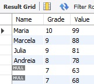

# Explaining my solutions
## Software Developer: Eduardo Nepomuceno da Rocha

### Question 3

For this question it was only necessary to use the if-else conditions. The developer needs to pay attention to which condition must be tested at first because it's possible to test a number which is a mutiple of 3 and not testing if it's a multiple of 5 too. Java was my choice just due to my most recent roles. 

### Question 4

Firstly I eliminated all the spaces of the string. Thereafter constraints were validated as exceptions (it becomes easier to test). The first if condition is because if the number of operations is greater than the sum of the lengths of the word, then it's possible to erase one and write another. After that, the remaining operations must be even in order to be possible undo and do the same operation. The rest of the static funcion extracts the prefix both words share (the sequence of letters in common) and calculates the number of operations. It's compared with k. The unique observation here is again the remaining number of operations(k-number calculated), which must be even. I like the class approach, so I created a class with a static function. The Main just calls this function. 

### Question 5

To test the method, I used a great combination of Java/Maven environment: Jacoco Plugin + Junit. By using Junit, we can use the asserts methods. All it's necessary to do is creating inputs to test all the cases and if conditions (that's why the code is so long). We have also to test the exceptions. The Jacoco Plugin creates a report of coverage, which can be seen below.

We can see a total coverage of the method. 

### Question 6 

I simulated the case which was written as a challenge. I used the MySQL Workbench just because the question says SQL(not PL/SQL for example). I know that it's mentioned the Oracle Database in the description of the role, but I prefered to work with the last database I've worked with. I created the base and the select, and chose to add every rule step by step. The most important points:

* INNER JOIN ON: The condition which joins the tables
* CASE WHEN: A Clause which defines the behaviour of the query for each mentioned case:
* ORDER BY clause: Defines the desc and asc(default) order.
* The question says something about the order and shows another. I chose to show both as below. 

 

### Question 7

I undestand Polymorphism as different ways(poly) to realize some operation. It's what this question writes about: A method is implemented in two different ways by using the children classes of a class. It uses a upcasting for it (declaring a child class for a parent class object). The method is therefore overwritten twice. 

### Question 8

I was thinking about using firstly the result of the union of the two tables as a subquery and after that I would apply the distinct clause. This is was not necessary because the union clause actually works showing only distinct registers (the option for returning all registers would be union all clause). So, when I used the union, I had already the required registers(distinct).

### Question 9

I think all the comments are in fact on the pdf of the solution and in the answer. We just need to follow the commands which are written for us and respect the other of processing. 

### Question 10

I chose the C language because I had already a model of this problem which I developed during my learning time. I've just improved the solution. The original solution is using a char vector of size 100. Nevertheless, let's say the user decides to type a long phrase. So the buffer would not support this operation. That's why I chose to work with pointer. If the memory is not enough, so we just increase the memory allocation(adding the size to the size). We have just to pay attention to free the memory and the character '\0' since we've been working with char in C and every string ends with this special character. 

### Question 11

I don't know any possible solution different than this which I have implemented by using pointers. If it was required to create it by using Java, I don't know hou I would proceed. We have the reverse method of the class Stringbuilder, but I thought that it was not the goal. So I chose to use the pointers math and a solution in C++. It can seem hard, but it's very simple indeed. We just make the math by using pointers. We use the pointers to have the control of the char of the word. We can pass to this pointer the address of the start char and end char, which was done. If we have the pointer, we can operate inside it, by changing its content. So, the only action we have to do is changing this content by using some logic. 

### Questions 12, 13, 14 and 15

They're all answered in the form. 

### Question 16. 

Here I will explaining why I didn't choose the options, or why I think that's false. I don't know the QT framework so deeply to be honest, some of them were just by what I think it's logical, others I knew in fact. I also tried to think as a C++ Developer and what would make sense. 

* First option: That was simple. A signal can be connect do more than one slot. We can test on QT. False.

* Second option: QObject doesn't allow any copy or clone. False.

* Third Option: I chose as True, but I don't know if this phrase is all correct. If a QWidget is added inside a QLayout, it seems logical that this widget will be managed by the Layout. True (but I am not sure)

* Fourth option: qmake doesn't compile the project because it's not a compiler. False

* Fifth option: Nothing to add to the phrase. True (Or can be false if it works with something else, I don't know)

* Sixth option: Nothing to add. Every character of Qstring uses 16 bits. It's the pattern. True

* Seventh option: It's a rule which must be followed. True

* Eighth option: Signals are never implemented in the header file. It's a little similar to a code in C when we work with libraries and headers. I think that my thinking line is correct. True

* Nineth question: When we say something is necessary, it means that without it we can not work. It's true. We can use Visual Studio for example (it's the way I know). True.